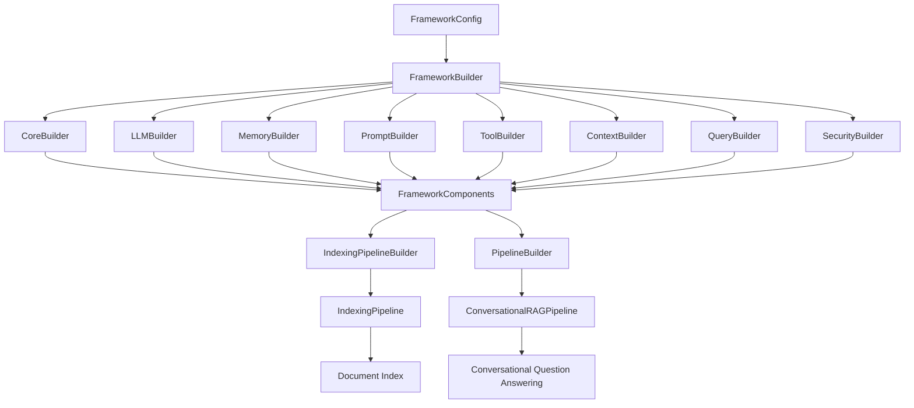
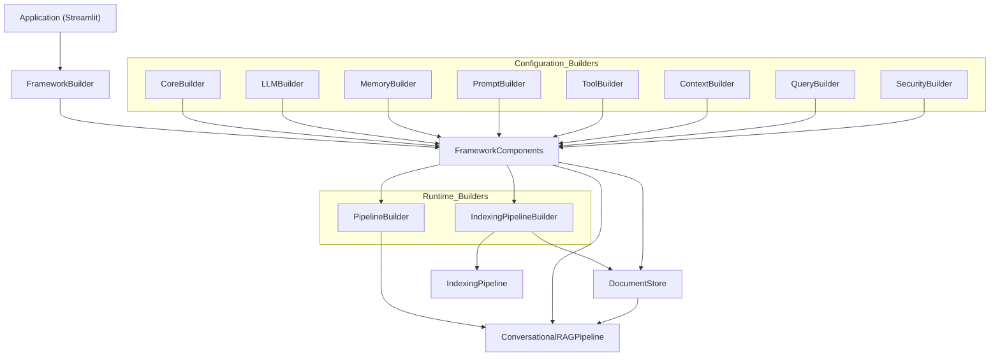
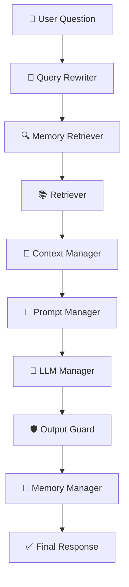

# MiniRAGFramework

A modular, configurable, and extensible Retrieval-Augmented Generation (RAG) framework built using modern software engineering principles.

> Designed to make RAG pipelines reusable, configurable, and easy to extend through builders, factories, managers, and strategy-based components.


## 📖 Overview

MiniRAGFramework is a modular framework for building Retrieval-Augmented Generation (RAG) applications.

Unlike traditional RAG implementations where every component is tightly coupled inside a single application, MiniRAGFramework separates configuration, runtime construction, and execution into independent modules. This allows developers to easily replace individual components such as LLMs, embedding models, retrievers, prompt templates, memory strategies, rerankers, and tool routers without changing the application logic.

The framework currently includes a Streamlit-based PDF Assistant that demonstrates how the framework can be used to build production-style conversational RAG applications.


## 🎯 Motivation

Most RAG projects are designed as single applications, making it difficult to experiment with different components or reuse them across projects.

MiniRAGFramework was developed to address this by introducing:

- Modular component construction
- Configurable framework initialization
- Runtime builders
- Factory-based component creation
- Strategy-based decision making
- Easy extensibility for future research


## ✨ Features

- 📄 Multi-PDF Retrieval-Augmented Generation
- 💬 Conversational Question Answering
- 🧠 Conversation Memory Support
- 🔄 Automatic Query Rewriting
- 🧩 Multiple Prompt Templates
- 🔍 Multiple Retrieval Strategies
- 🛡️ Security Guards
- 📊 Token Budget Management
- 🛠️ Tool Calling Framework
- ⚙️ Fully Configurable Builder Architecture
- 🔌 Easily Extendable Components


## 🏛️ Framework Design

MiniRAGFramework is designed using modular software engineering principles to ensure extensibility, maintainability, and component reusability. Instead of tightly coupling all functionality into a single application, the framework separates responsibilities across multiple architectural layers and design patterns.

| Design Pattern | Purpose | Example Components |
|----------------|---------|--------------------|
| **Builder Pattern** | Constructs complex framework components in a structured manner | `CoreBuilder`, `LLMBuilder`, `MemoryBuilder`, `PromptBuilder`, `ToolBuilder`, `ContextBuilder`, `QueryBuilder`, `SecurityBuilder`, `IndexingPipelineBuilder`, `PipelineBuilder` |
| **Factory Pattern** | Creates interchangeable implementations based on configuration | `LoaderFactory`, `SplitterFactory`, `EmbeddingFactory`, `RetrieverFactory`, `LLMFactory`, `MemoryFactory`, `PromptFactory`, `SecurityGuardFactory`, `RerankerFactory` |
| **Strategy Pattern** | Supports multiple algorithms for the same task | Context Strategies, Prompt Routers, Tool Routers, Memory Retrieval, Query Rewriting, Token Budget Strategies |
| **Manager Pattern** | Coordinates interactions between related components | `LLMManager`, `PromptManager`, `MemoryManager`, `ContextManager`, `ToolManager`, `QueryRewriterManager`, `MemoryRetrieverManager` |

---

### Builder Pattern

The framework uses the **Builder Pattern** to construct complex objects in a structured manner. Each builder is responsible for creating a specific subsystem while the `FrameworkBuilder` orchestrates the complete initialization process.

Current builders include:

- CoreBuilder
- LLMBuilder
- MemoryBuilder
- PromptBuilder
- ToolBuilder
- ContextBuilder
- QueryBuilder
- SecurityBuilder
- IndexingPipelineBuilder
- PipelineBuilder

This approach keeps object construction centralized and prevents application code from manually instantiating framework components.

---

### Factory Pattern

Factories are responsible for creating interchangeable implementations based on configuration.

Examples include:

- LoaderFactory
- SplitterFactory
- EmbeddingFactory
- VectorStoreFactory
- RetrieverFactory
- MemoryFactory
- PromptFactory
- LLMFactory
- SecurityGuardFactory
- RerankerFactory

This enables developers to switch implementations simply by modifying the framework configuration without changing application code.

---

### Strategy Pattern

The framework employs the **Strategy Pattern** wherever multiple algorithms or decision-making mechanisms may exist.

Current strategy-based components include:

- Context selection strategies
- Prompt routing strategies
- Tool routing strategies
- Memory retrieval strategies
- Query rewriting strategies
- Token budgeting strategies

This makes it straightforward to introduce new algorithms while keeping existing components unchanged.

---

### Manager Pattern

Managers coordinate the interaction between related components while exposing a simplified interface to the rest of the framework.

Examples include:

- PromptManager
- ContextManager
- ToolManager
- MemoryManager
- QueryRewriterManager
- MemoryRetrieverManager
- LLMManager

Managers encapsulate orchestration logic and reduce coupling between modules.

---

### Configuration Layer

Framework initialization is driven entirely through a centralized `FrameworkConfig` object.

The configuration determines:

- Document loader
- Text splitter
- Embedding model
- Vector store
- Retriever
- Available LLMs
- Memory strategy
- Prompt routing strategy
- Tool routing strategy
- Context routing strategy
- Query rewriting strategy
- Security strategy
- Reranker

This allows the same framework to support different RAG configurations without modifying internal implementation.

---

### Runtime Layer

The framework distinguishes between reusable configuration components and runtime objects.

Configuration builders construct reusable framework services, while runtime builders create session-specific objects such as:

- DocumentStore
- IndexingPipeline
- ConversationalRAGPipeline

This separation ensures that framework configuration remains independent of application execution, resulting in a cleaner and more maintainable architecture.


## ⚙️ Framework Initialization Flow

The following diagram illustrates how the framework is initialized from configuration to runtime.




### Initialization Process

Framework initialization occurs in two distinct phases:

1. **Configuration Phase**
   - A `FrameworkConfig` object specifies all configurable framework options.
   - `FrameworkBuilder` invokes specialized builders to construct reusable framework components.
   - These components are stored inside a centralized `FrameworkComponents` container.

2. **Runtime Phase**
   - Runtime builders assemble session-specific objects.
   - `IndexingPipelineBuilder` creates the indexing pipeline responsible for processing uploaded documents.
   - `PipelineBuilder` assembles the complete conversational RAG pipeline by wiring together all previously constructed framework components.

This layered initialization process separates framework construction from application execution, making the framework modular, extensible, and easy to maintain.


## 🏗️ Framework Architecture




## 🚀 Request Processing Flow

The following sequence illustrates how a user query travels through the framework during a conversational RAG interaction.




### Execution Pipeline

During inference, every user query passes through multiple framework components before producing the final response.

1. **Query Rewriter**
   - Improves ambiguous or incomplete user queries.
   - Generates retrieval-friendly search queries.

2. **Memory Retrieval**
   - Retrieves relevant conversation history.
   - Supplies previous interactions when necessary.

3. **Retriever**
   - Performs semantic retrieval over indexed document chunks.
   - Returns the most relevant context.

4. **Context Manager**
   - Selects the appropriate context construction strategy.
   - Combines retrieved documents, memory, and system context.

5. **Prompt Manager**
   - Builds the final prompt using configurable prompt templates.
   - Applies routing when multiple prompt types are available.

6. **LLM Manager**
   - Sends the constructed prompt to the selected language model.
   - Supports multiple LLM providers through a unified interface.

7. **Output Guard**
   - Performs post-processing and validation of generated responses.
   - Ensures safe and consistent outputs.

8. **Memory Manager**
   - Updates the conversation memory with the latest interaction.
   - Maintains conversational continuity for future queries.

Finally, the processed response is returned to the user.


## 📂 Project Structure

```text
MiniRAGFramework
│
├── apps/                      # Example applications built using the framework
│   └── pdf_assistant2.py
│
├── src/
│   ├── config/                # Framework configuration and builders
│   │   ├── framework_builder.py
│   │   ├── framework_config.py
│   │   ├── core_builder.py
│   │   ├── llm_builder.py
│   │   ├── memory_builder.py
│   │   ├── prompt_builder.py
│   │   ├── tool_builder.py
│   │   ├── context_builder.py
│   │   ├── query_builder.py
│   │   ├── security_builder.py
│   │   ├── indexing_pipeline_builder.py
│   │   └── pipeline_builder.py
│   │
│   ├── factories/             # Factory implementations
│   ├── managers/              # High-level orchestration components
│   ├── strategies/            # Strategy implementations
│   ├── pipelines/             # Indexing and conversational pipelines
│   ├── prompts/               # Prompt templates and prompt routing
│   ├── llm/                   # LLM implementations
│   ├── memory/                # Memory implementations
│   ├── retrieval/             # Retrieval implementations
│   ├── reranking/             # Reranking modules
│   ├── tools/                 # Tool calling framework
│   ├── security/              # Security and output guards
│   ├── embeddings/            # Embedding models
│   ├── vectorstores/          # Vector database implementations
│   ├── loaders/               # Document loaders
│   ├── splitters/             # Document splitters
│   ├── document_store/        # Runtime document storage
│   └── ...
│
├── tests/                     # Unit tests
│
├── data/                      # Sample documents
│
├── chroma_db/                 # Persistent vector database
│
├── requirements.txt
│
└── README.md
```


### Organization Philosophy

The framework is organized according to responsibility rather than feature.

- **Configuration** (`config/`) constructs the framework.
- **Factories** create interchangeable implementations.
- **Managers** coordinate subsystem interactions.
- **Strategies** encapsulate different algorithms.
- **Pipelines** orchestrate indexing and conversational workflows.
- **Applications** demonstrate how the framework can be used without exposing internal implementation details.

This modular organization allows new components to be added with minimal changes to the existing framework.